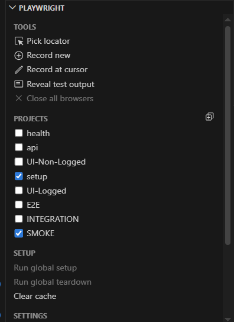

# Project Playwright TS Automation Tests Template

### Tech

- Typescript
- Playwright
- NodeJS
- AzureDevops

### Read file Coding Standards before implementation

- CODING_STANDARDS.md

## File Naming Convention

- Use kebab-case for file name: `register-page.ts`

## Variable Naming Convention

- Use camelCase for variable and function names: `personalCode`, `registerUser`
- Use PascalCase for class name: `RegisterPage`

### Installation

```Shell
# Install all modules
npm install
or
npm ci
```

Install playwright

- install latest version of `npm i @playwright/test`
- install latest version of browsers `npx playwright install`
- check version `npx playwright --version`

create folder named .vscode
in folder create file settings.json
paste code to file

```javascript
{
  "editor.formatOnSave": true,
  "editor.defaultFormatter": "esbenp.prettier-vscode",
  "editor.codeActionsOnSave": {
    "source.organizeImports": "explicit"
  },
  "typescript.preferences.importModuleSpecifier": "non-relative",
  "files.autoSave": "afterDelay",
}
```

### For update or generate useful commands please use ready scripts in package.json

## Before first run project please checkout env variables

For example open project folder config/env.config.ts
checkout mandatory variables in file

Then set missing variables in
config/env.config.ts
or in other env file already used for test purposes

### Choice test environment

Navigate into config/env.config.ts

In this file set default env for example below:

```javascript
const defaultEnvironment = environments.local;
```

## Run local test by playwright addon

Select correct config and project want to test



## Run local specific test from terminal

Choose correct project config "project=Chrome"
project name can be founded in section named projects in the file /playwright.config.ts

```Shell
npx cross-env ENVIRONMENT=local npx playwright test test.spec.ts --project=UI-Logged --workers=1

or run all tests for specific project
npx cross-env ENVIRONMENT=local npx playwright test --project=UI-Logged --workers=1

```

## Run tests with specific tag or tags and project

```javascript
npx playwright test --project=UI-Logged --grep "(?=.*@E2E\b)(?=.*@SMOKE\b)"
```

##
